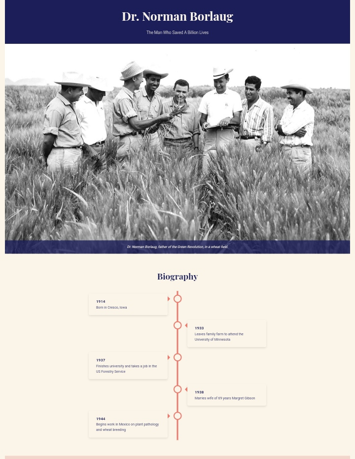

# Dr. Norman Borlaug Tribute Page

This project is a tribute page dedicated to Dr. Norman Borlaug, known as "The Man Who Saved A Billion Lives." It was created as part of the freeCodeCamp Responsive Web Design certification.

## Features

- Responsive design that works on desktop and mobile browsers
- Timeline of Dr. Borlaug's life events
- Achievements section highlighting key accomplishments
- Quote section with a notable statement from Dr. Borlaug
- Legacy information and link to learn more

## Technologies Used

- HTML5
- CSS3
- JavaScript

## Screenshot

## How to Run

1. Clone this repository
2. Open `index.html` in your web browser

## Acknowledgments

- freeCodeCamp for the project idea and requirements

## License

This project is open source and available under the [MIT License](LICENSE).
